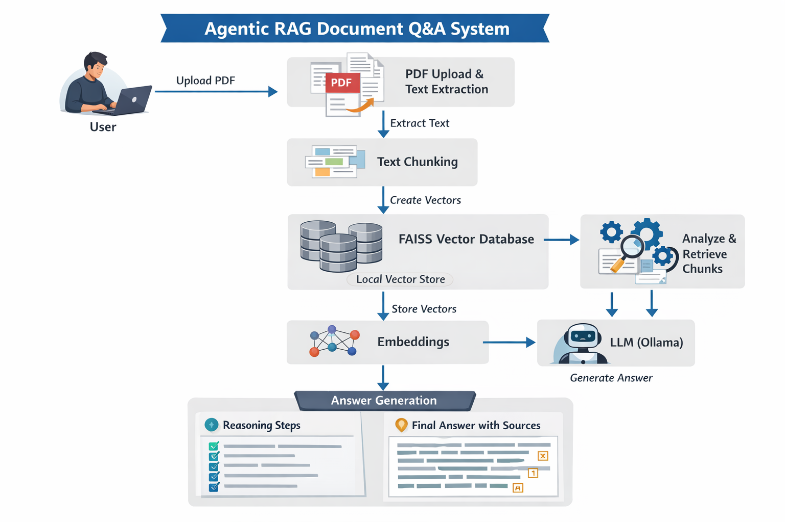
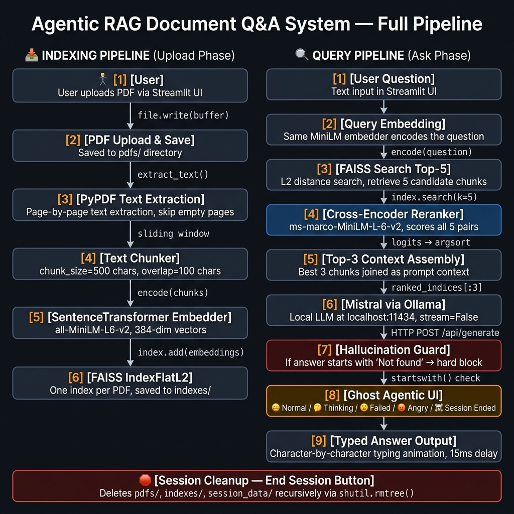

# 👻 Agentic RAG Document Q&A System

> **Local-First • Hallucination-Safe • Session-Scoped • Agent-Driven UI**

A fully local Retrieval-Augmented Generation (RAG) system that lets you upload PDFs and ask questions **strictly grounded in document content** — zero hallucinations, no cloud APIs, and automatic cleanup of all embeddings when the session ends.

---

## 🏗️ Architecture Overview

The system runs two distinct pipelines: an **Indexing Pipeline** triggered on upload, and a **Query Pipeline** triggered on each question.

### High-Level System Diagram



---

### 🔬 Full Step-by-Step Pipeline Diagram

> This diagram maps every function call in the codebase to the pipeline stage it belongs to.



---

## ⚙️ How the Pipeline Works (Step by Step)

### 📥 Phase 1 — Indexing Pipeline (Triggered on PDF Upload)

| Step | What Happens | Code |
|------|-------------|------|
| **1. Upload** | User uploads one or more PDFs via Streamlit's file uploader | `st.file_uploader()` |
| **2. Save** | PDF is written to disk in `pdfs/` if it doesn't already exist | `file.write(buffer)` |
| **3. Text Extraction** | PyPDF reads each page and extracts raw text, skipping empty pages | `read_pdf_text()` |
| **4. Chunking** | Text is split into overlapping windows of 500 characters with a 100-character overlap to prevent context loss at boundaries | `chunk_text(size=500, overlap=100)` |
| **5. Embedding** | Each chunk is encoded into a 384-dimensional vector using `all-MiniLM-L6-v2` | `embedder.encode(chunks)` |
| **6. FAISS Index** | Vectors are stored in a `FAISS IndexFlatL2` index — one separate index per PDF. Both the `.index` binary and a `.txt` chunk file are saved to `indexes/` | `faiss.write_index()` |

---

### 🔍 Phase 2 — Query Pipeline (Triggered on Each Question)

| Step | What Happens | Code |
|------|-------------|------|
| **7. Query Embed** | The user's question is encoded into a vector using the same MiniLM model | `embedder.encode([question])` |
| **8. FAISS Search** | Top-5 nearest chunks are retrieved from the selected PDF's FAISS index using L2 distance | `index.search(q_vec, k=5)` |
| **9. Cross-Encoder Rerank** | All 5 (question, chunk) pairs are scored by `ms-marco-MiniLM-L-6-v2`. The model outputs relevance logits; chunks are sorted descending | `rerank_model(**inputs).logits` |
| **10. Top-3 Assembly** | The top-3 ranked chunks are joined into a context string | `ranked_indices[:3]` |
| **11. Mistral / Ollama** | The context + question are sent as a structured prompt to Mistral running locally via Ollama's HTTP API | `POST localhost:11434/api/generate` |
| **12. Hallucination Guard** | If the model's answer begins with `"Not found in the document"`, it is hard-blocked and returned as-is — the model cannot override this | `startswith()` check |
| **13. Ghost UI Reaction** | The ghost emoji reacts to system state: 😄 idle → 🤔 thinking → 😵 one failure → 😡 3+ failures → ☠️ session ended | `st.session_state.ghost_mood` |
| **14. Typed Output** | The answer is streamed character-by-character to the UI with a 15ms delay per character | `time.sleep(0.015)` |

---

### 🛑 Phase 3 — Session Cleanup (Triggered on "End Session")

When the user clicks **End Session**, `cleanup_session_data()` runs:

```
pdfs/           → all uploaded PDFs deleted
indexes/        → all FAISS indexes and chunk .txt files deleted
session_data/   → entire directory tree wiped via shutil.rmtree()
```

Streamlit session state is cleared and execution halts — no data persists.

---

## 🧰 Tech Stack

| Layer | Technology | Why |
|-------|-----------|-----|
| UI | Streamlit | Rapid local UI, session state management |
| LLM | Mistral via Ollama | Fully local, no API cost, works offline |
| Embeddings | `all-MiniLM-L6-v2` | Fast, lightweight, strong semantic performance |
| Reranker | `ms-marco-MiniLM-L-6-v2` | Industry-standard cross-encoder for relevance scoring |
| Vector DB | FAISS `IndexFlatL2` | Raw control, no hidden memory, debuggable |
| PDF Parsing | PyPDF | Clean page-by-page extraction |
| Language | Python 3.10+ | — |

---

## 🚀 How to Run

```bash
# 1. Install dependencies
pip install -r requirement.txt

# 2. Start Ollama with Mistral
ollama run mistral

# 3. Launch the app
streamlit run app.py
```

Open: [http://localhost:8501](http://localhost:8501)

---

## 🔒 Security & Privacy Design

- **All inference is local** — no data ever leaves your machine
- **No cloud API calls** — Ollama runs entirely on `localhost:11434`
- **Session-scoped storage** — all PDFs and embeddings are deleted on session end
- **Hallucination guard** — model cannot fabricate answers not found in the document
- **`.gitignore` enforced** — `pdfs/`, `indexes/`, and `session_data/` are never committed to Git

---

## ⚠️ Deployment Note

This system runs **fully locally** using **Ollama + Mistral** and requires a local runtime environment. It cannot be deployed directly to cloud platforms without replacing the Ollama layer with a cloud LLM API.

This design was intentional to ensure complete data privacy, zero API dependency, offline capability, and enterprise-safe document processing.

---

## 🗺️ Next-Generation AI Features Roadmap (Production-Grade RAG)

To transition this local-first architecture into a highly robust, enterprise-ready RAG system, the following features are planned for future iterations:

### 1. 🔍 Hybrid Retrieval (Sparse + Dense Fusion)
* **The Problem**: Dense vector search (FAISS) matches *concepts* well, but often fails on exact keyword matching, serial numbers, specific names, or product codes.
* **The Solution**: Query a local sparse keyword ranker (BM25) and the FAISS dense ranker in parallel, then merge their results using **Reciprocal Rank Fusion (RRF)**.
* **Impact**: Ensures perfect keyword matching alongside strong semantic understanding.

### 2. 🔄 Self-RAG (Self-Correction & Agentic Grading Loop)
* **The Problem**: Standard RAG is a passive chain that blindly forwards retrieved chunks to the LLM, leaving the system vulnerable to irrelevant context and hallucinations.
* **The Solution**: Wrap the pipeline in an active self-correcting agent loop:
  * **Document Grader**: Verify retrieved chunks are relevant to the query. If they are not, automatically rewrite/expand the query and search again.
  * **Hallucination Grader**: Verify the generated LLM response is strictly grounded in the retrieved facts.
  * **Answer Utility Grader**: Verify the response fully answers the user's question.
* **Impact**: Drastically reduces hallucination rates and makes the system truly "agentic".

### 3. 🌳 Hierarchical Retrieval (Parent-Child Chunking)
* **The Problem**: Small chunks (e.g., 200 characters) yield highly accurate semantic vector matches but lack complete context. Large chunks (e.g., 2000 characters) provide full context but dilute embedding similarity.
* **The Solution**: Split the document hierarchically. Store and embed smaller **Child Chunks** for high-precision semantic search, but when a match is found, retrieve and pass the corresponding **Parent Chunk** to the LLM.
* **Impact**: Delivers high-accuracy matching without losing context depth.

### 4. 📊 Performance & Retrieval Dashboard
* **The Problem**: The user has zero visibility into how the RAG system made its retrieval decisions or what the latency bottleneck is.
* **The Solution**: Build an interactive dashboard in the Streamlit sidebar displaying:
  * **Latency Breakdown**: Time spent on embedding generation, vector search, cross-encoder reranking, and LLM token generation.
  * **Retrieval Confidence**: Real-time progress bars showing similarity/relevance scores for retrieved chunks.
* **Impact**: Provides full transparency and developer observability.

### 5. 🖼️ Multi-Modal Chart & Table RAG
* **The Problem**: Crucial technical information stored inside PDF charts, figures, and complex tables is completely skipped by traditional raw text parsers.
* **The Solution**: Extract pages as images and use a local multi-modal model (like `llama3.2-vision` via Ollama) to index and explain visual figures.
* **Impact**: Enables complete document coverage, bridging the gap between unstructured text and visual charts.

---

## 📁 Project Structure

```
agentic_rag1/
├── app.py                  # Full application — both pipelines
├── requirement.txt         # Pinned dependencies
├── .gitignore              # Excludes pdfs/, indexes/, session_data/, venv
├── architecture_diagram.png   # High-level system overview
├── pipeline_diagram.png       # Step-by-step full pipeline diagram
├── README.md
├── pdfs/                   # [gitignored] Uploaded PDFs (runtime only)
├── indexes/                # [gitignored] FAISS indexes (runtime only)
└── session_data/           # [gitignored] Orphaned artifacts (auto-cleaned)
```